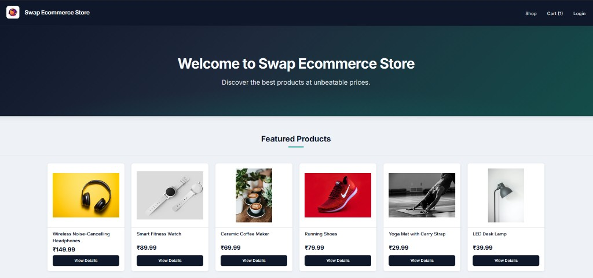
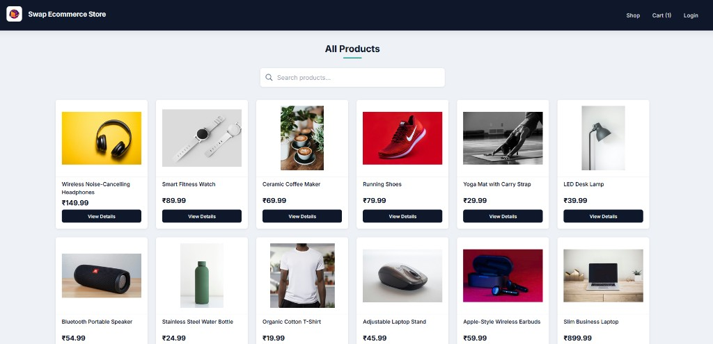
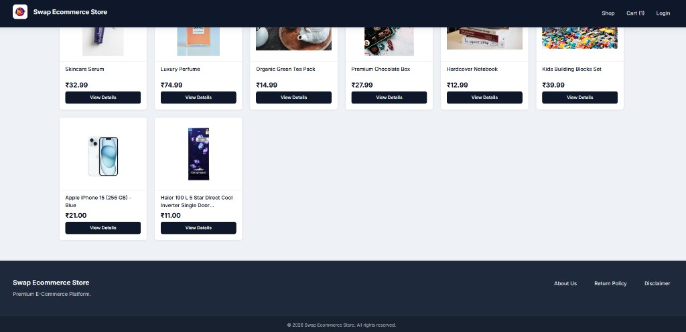

# Swap Ecommerce Store

A full-stack MERN e-commerce web application with a responsive shopping experience, secure authentication, Razorpay payments, and an admin panel for product and order management.

**Live application:** [https://swap-ecommerce-store.onrender.com](https://swap-ecommerce-store.onrender.com)

---

## Screenshots

### Home — Featured Products


### Shop — Product Catalog


### Shop — Extended Catalog


---

## Features

### Customer Experience
- **Home page** with featured products and a welcoming hero section
- **Product catalog** with search, product cards, pricing, and stock visibility
- **Product details** with images, descriptions, and out-of-stock handling
- **Shopping cart** powered by Redux Toolkit with persistent cart state
- **Secure checkout** with Razorpay integration (test and live modes supported)
- **Order confirmation** with success page, invoice details, and professional HTML email
- **User profile** with order history, invoice details, and transaction information
- **Responsive design** optimized for desktop, tablet, and mobile

### Authentication & Security
- User registration with **email OTP verification**
- Registration limited to **trusted email providers** (Gmail, Yahoo, Outlook, Hotmail, iCloud, and more)
- JWT-based login and session management
- Role-based access control (`user` and `admin`)
- Protected API routes with authentication middleware

### Admin Panel
- **Dashboard** with store overview and analytics
- **Product management** — add, edit, delete, and list products with image upload
- **Order management** — view full order details, customer info, items, and update status
- **User directory** — view registered (verified) users
- Stock management with automatic deduction when orders are placed
- Delete confirmation modals for safer admin actions

### Backend & Integrations
- RESTful APIs for auth, products, orders, payments, and analytics
- MongoDB database with Mongoose models
- Razorpay payment order creation and signature verification
- Nodemailer for OTP registration and order confirmation emails
- HTML email templates for OTP and order notifications
- Database seeding scripts for products and sample data
- Production-ready deployment on Render (frontend build served by Express)

### Information Pages
- About Us (platform overview and creator profile)
- Return Policy
- Disclaimer

---

## Technology Stack

### Frontend
| Technology | Purpose |
|------------|---------|
| React.js | UI components and SPA architecture |
| Redux Toolkit | Cart and global state management |
| React Router | Client-side routing |
| HTML5 / CSS3 | Responsive layouts and custom styling |
| Tailwind CSS | Utility styling (notifications and selected UI) |
| Create React App | Build tooling and development server |

### Backend
| Technology | Purpose |
|------------|---------|
| Node.js | Server runtime |
| Express.js | REST API and static file serving |
| MongoDB | Document database |
| Mongoose | Data modeling and queries |
| JWT | Authentication tokens |
| bcryptjs | Password and OTP hashing |
| Multer | Product image uploads |
| Nodemailer | Transactional emails |
| Razorpay | Payment gateway |
| dotenv | Environment configuration |

### DevOps & Tooling
| Technology | Purpose |
|------------|---------|
| Git / GitHub | Version control |
| Render | Cloud hosting and deployment |
| Concurrently | Local full-stack development |
| Nodemon | Backend hot reload during development |

---

## Project Structure

```
mern-e-commerce/
├── backend/
│   ├── config/          # Database connection
│   ├── controllers/     # Route handlers
│   ├── middlewares/     # Auth and admin guards
│   ├── models/          # Mongoose schemas
│   ├── routes/          # API routes
│   ├── utils/           # Email templates, helpers
│   ├── uploads/         # Product images
│   ├── index.js         # Server entry point
│   └── seed.js          # Database seeding
├── frontend/
│   ├── public/          # Static assets
│   ├── src/
│   │   ├── admin/       # Admin panel pages
│   │   ├── components/  # Reusable UI components
│   │   ├── context/     # Auth and notifications
│   │   ├── pages/       # Customer-facing pages
│   │   ├── redux/       # Store and cart slice
│   │   ├── styles/      # CSS modules
│   │   └── utils/       # API and helper utilities
│   └── package.json
├── docs/
│   └── screenshots/     # README images
├── package.json         # Root scripts
└── render.yaml          # Render deployment blueprint
```

---

## Getting Started

### Prerequisites
- Node.js (v18 or later recommended)
- npm
- MongoDB database (local or MongoDB Atlas)
- Razorpay account (for payments)
- Gmail or SMTP credentials (for email notifications)

### 1. Clone the repository

```bash
git clone https://github.com/menkar/mern-e-commerce.git
cd mern-e-commerce
```

### 2. Install dependencies

```bash
npm run install-all
```

### 3. Configure environment variables

Create a `backend/.env` file with the following variables. **Do not commit this file to version control.**

```env
PORT=5000
NODE_ENV=development
MONGO_URI=your_mongodb_connection_string
JWT_SECRET=your_jwt_secret

# Email (OTP & order notifications)
EMAIL_USER=your_email_address
EMAIL_PASS=your_app_password

# Razorpay
RAZORPAY_KEY_ID=your_razorpay_key_id
RAZORPAY_SECRET=your_razorpay_secret

# Optional — production CORS
FRONTEND_URL=http://localhost:3000
```

> **Note:** Never share API keys, database URIs, or secrets publicly. Use environment variables only.

### 4. Seed the database (optional)

```bash
npm run seed
```

This creates sample products and an admin user. Refer to the seed script for admin setup details in your local environment.

### 5. Run locally

**Full stack (recommended):**
```bash
npm run dev
```

**Backend only:**
```bash
npm run dev:server
```

**Frontend only:**
```bash
npm run dev:client
```

- Frontend: [http://localhost:3000](http://localhost:3000)
- Backend API: [http://localhost:5000](http://localhost:5000)

### 6. Production build

```bash
npm run build
cd backend
NODE_ENV=production npm start
```

---

## Available Scripts

| Script | Description |
|--------|-------------|
| `npm run install-all` | Install root, backend, and frontend dependencies |
| `npm run dev` | Run backend and frontend concurrently |
| `npm run dev:server` | Start backend with nodemon |
| `npm run dev:client` | Start React development server |
| `npm run build` | Build frontend for production |
| `npm run render-build` | Build frontend and install backend (for Render) |
| `npm start` | Start production backend server |
| `npm run seed` | Seed products and admin user |
| `npm run seed:full` | Full database seed with sample users and orders |

---

## API Overview

| Endpoint | Description |
|----------|-------------|
| `POST /api/v1/auth/register` | Register a new user (sends OTP) |
| `POST /api/v1/auth/verify-otp` | Verify email OTP and activate account |
| `POST /api/v1/auth/resend-otp` | Resend registration OTP |
| `POST /api/v1/auth/login` | User login |
| `GET /api/v1/auth/me` | Get current user profile |
| `GET /api/v1/products` | List products |
| `POST /api/v1/orders` | Create order |
| `GET /api/v1/payments/config` | Get Razorpay configuration |
| `POST /api/v1/payments/order` | Create Razorpay order |
| `POST /api/v1/payments/verify` | Verify payment signature |
| `GET /api/v1/analytics` | Admin dashboard statistics |

---

## Deployment (Render)

1. Connect your GitHub repository to Render.
2. Set **Root Directory** to `backend` (or use repo root with `render.yaml`).
3. **Build Command:** `npm run render-build`
4. **Start Command:** `npm start`
5. Add all required environment variables in the Render dashboard.
6. Set `NODE_ENV=production` and `FRONTEND_URL` to your live URL.

---

## Developer

**Swapnil Menkar**  
Mobile: [+91 8149005578](tel:+918149005578)  
Email: [swapnilmenkar@gmail.com](mailto:swapnilmenkar@gmail.com)  
LinkedIn: [swapnil-menkar-7051852b](https://www.linkedin.com/in/swapnil-menkar-7051852b/)

### Technical Expertise Summary

- **Frontend:** React.js, Redux Toolkit, React Router, TypeScript / JavaScript, HTML5, CSS3, SASS, responsive UI, component-driven architecture, AG Grid
- **Backend:** Node.js, Express.js, REST APIs, JWT authentication, role-based access control
- **Databases:** MongoDB, PostgreSQL, MySQL
- **Architecture:** Micro-frontends, monorepo patterns, SPA design, state management (Redux, RxJS, NgRx)
- **Cloud & DevOps:** Azure, AWS, CI/CD pipelines
- **Tools:** Git, Postman, Generative AI–assisted development (GitHub Copilot, Cursor, ChatGPT)
- **Domains:** E-commerce, enterprise web applications, banking, hospitality, and retail solutions

---

## License

ISC

---

## Acknowledgements

Thank you for visiting **Swap Ecommerce Store**. This project demonstrates end-to-end full-stack development — from product browsing and secure payments to admin operations and cloud deployment.

If you find this project useful, please consider giving it a star on GitHub.
